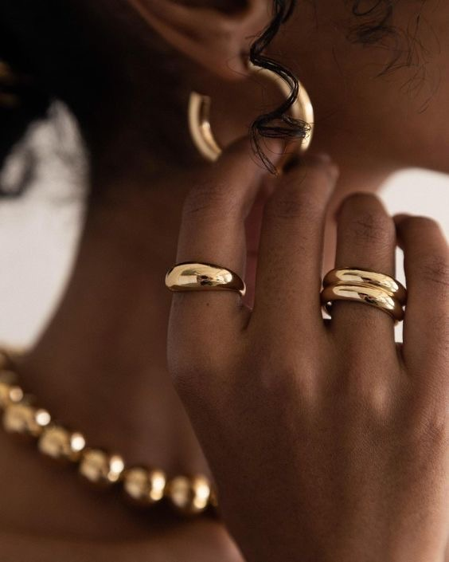

# 💎 Lovs Jewelry

**Lovs Jewelry** is a luxurious, handcrafted landing page designed to showcase elegant jewelry pieces with a timeless and minimal aesthetic. Built using only HTML, CSS, and JavaScript — it’s perfect for small boutiques, personal brands, or portfolio demonstrations.

---

## 🌟 Live Demo

🔗 [View Live Site](https://codebyoma01.github.io/lovs-jewelry/)

---

## ✨ Features

- 🎨 Elegant dark-themed design with Playfair Display & Inter fonts
- 🖼️ Featured collection gallery with multiple product images
- 📩 Preorder form with validation and friendly thank-you message
- 💡 Fully responsive and mobile-ready
- 🔒 Pure frontend project (no backend/email integration)

---

## 📸 Preview

---

## 🔧 Tech Stack

- HTML5
- CSS3 (custom styling, no frameworks)
- JavaScript (for form interactivity)

---

## 📁 Folder Structure

